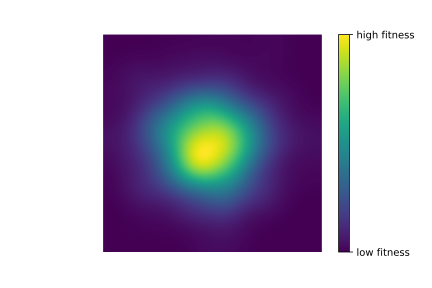
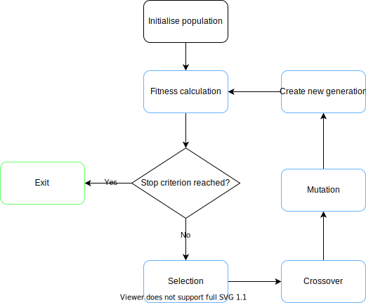
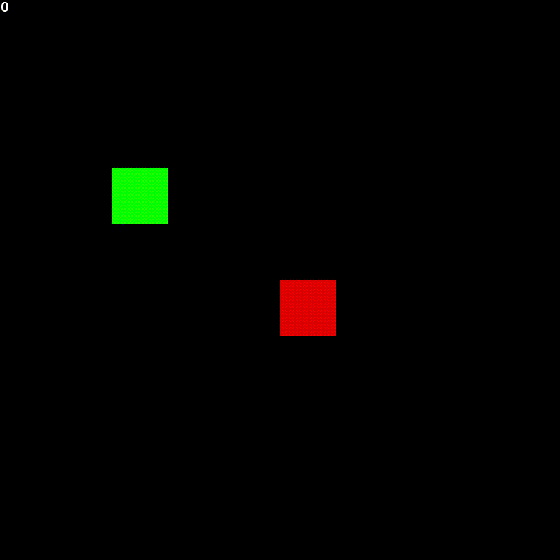
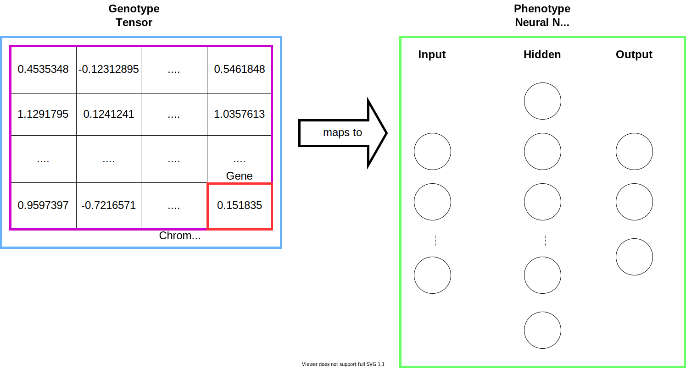

# 1. Snakevolution
Snakevolution is a project applying the concept of evolutionary computing to the game of Snake.

# 2. Evolutionary Algorithms
An evolutionary algorithm is a strategy to solve optimisation problems. Finding solutions for such
tasks is often difficult due to the large search space, i.e. the set of possible solutions is 
too large to find an exact solution. An evolutionary algorithm approximates the solution to an optimisation problem by evolving a set of
**candidate solutions** until a stop criterion is reached. 


<figure>

</figure>

First, a set of so called **candidate solutions** is randomly initialised. 
Thereafter, these solutions are assigned a fitness score depending on how well
they solve the problem. Usually, there is a positive correlation between the fitness score and the
performance of a solution, i.e. the higher the fitness score, the better the individual performed.
A better performing individual has more desirable traits, so the next step is to select a subset
of the population with desirable traits that we will recombine to create the next generation.
To do this step, we make use of crossover operators which will combine the genes of two
parents to create two offspring that inherit traits from both parents. Finally, the solutions
are mutated, i.e. some genes are randomly changed, and we create a new generation of solutions
with the recombined and mutated solutions.

<div align="center">
<figure>

<br>
<figcaption align="center"><b>Steps in the evolutionary algorithm</b></figcaption>
</figure>
</div>

# 3. Snake
Snake is a video game where the player controls a line representing the snake with the goal to grow the snake
as long as possible by eating food. Each food consumed grows the body of the snake by 1 block. 
Initially, the snake starts out with a length of 1. The game is won when the snake takes 
up every single block in the game, i.e. 100 blocks for a 10x10 grid. The game is 
over if the snake either hits any of the walls or itself. 

<div align="center">

<br>
<figcaption align="center"><b>Example of a Snake that has <br>been evolved for 1000 generations</b></figcaption>
</div>

This project uses my `pysnakegym` package for simulating the game. More details about this package can be found
on its [github page](https://github.com/jonasbarth/pysnakegym).

# 4. Snake + Evolution

How is the concept of evolution combined with the The **phenotype** of an organism consists out of its properties that are observable to the outside world, e.g.
behaviour and appearance. In this case, the phenotype is a Feed Forward Network (FFN) which receives an input representing the current 
state of the game and then outputs an action for the snake to take. The state of the game can be
thought of as what the snake sees at a given point in the game. 

The **genotype** of an organism are the genes that it carries and which determine the phenotype. In this case, the 
genotype are the bits and pieces that make up the neural network, i.e. the weights, connections,
and nodes. 

The individual weights of the network are the genes of the genotype. By evolving these weights,
the algorithm can produce phenotypes which are capable of playing the game of snake.

<figure>

</figure>

The **genotype** is part of the search space in which we look for good combinations of genes to solve the problem.
It maps to a **phenotype** which exists in a solution space where the external attributes of the solution are
evaluated against the problem to compute the fitness score.


# 5. Project Structure
* agents: contains classes that interfaces with the game
* docs: contains documentation
* evolution: contains the logic for the evolutionary algorithm
* test: contains tests
* util: contains classes for io and analysis operations

# 6. Setting up the Project

## 6.1 Install conda
snakevolution is a conda project, so conda needs to be installed to run the program. Follow the
instructions on the official [conda page](https://conda.io/projects/conda/en/latest/user-guide/install/index.html).

## 6.2 Setup the conda environment
After installing conda, the conda environment needs to be set up. The environment is described with the `environment.yml`
file. To create a conda environment from the file execute the following in the root directory of the project:
```bash
conda env create -f environment.yml
```

## 6.3 Activate the conda environment
The conda environment needs to be activated for the program to run.
```bash
conda activate snakevolution
```

# 7. How to train the evolutionary algorithm
Evolutionary algorithms have many hyperparameters that affect the performance and convergence of the
algorithm. Many of the hyperparameters affect the selection pressure experienced by the population. Read
**8** for an explanation of selection pressure. Below is an explanation of the available hyperparameters.

|hyper parameter   | type  | legal values  | explanation  |  
|---|---|---|---|
| generations  | int  | (-inf, inf)  |  the number of generations that the population will evolve for  |  
| population_size  | int  | (-inf, inf)  | the number of individuals in the population  |  
| mutation_rate  | int  | [0.0, 1.0]  |  the probability of a random mutation occurring for each gene  | 
| crossover_rate | float | [0.0, 1.0] | the probability that a crossover between two parents will occur |
| selection_type| string | {"TOURNAMENT", "RANK", "ROULETTE"} | the name of the selection function to be used |
| selection_params| {} | depends on the fitness function | additional parameters that will be passed to the selection function |
| type| string | {"GENERATIONAL", "STEADY_STATE"} | the type of algorithm to be run |
| replacement_function| string | {"REPLACEMENT"} | the type of replacement function to be used |
| elitism| float | [0.0, 1.0] | the percentage of best performing individuals that will be copied to the next generation unchanged |
| graphics| bool | {true, false} | whether to show the graphics of the snake game |
| neural_network| [int] | any positive integer | the hidden layers to be used in the neural network. [5] means a single hidden layer with 5 nodes |

These hyperparameters are passed to a program in a `.json` file. The `hyper_params.json` file
is an example file, though the file can live anywhere on the file system. Once the file is
created, the training can be started as follows:
```bash
python train.py -hp=hyper_params.json -ex=1
```
The `-hp` flag takes the path to the parameters file and the `ex` flag is how often the training
should be executed. If you want to gather some data on how a set of hyper parameters performs you
can specify to run it as many times as needed.

After each execution of the evolutionary algorithm, the following are saved in `models/evolution/<datetime>`:
* a csv file `fitness_data.csv` containing fitness data where columns are the generations and rows are individuals
* a json file `hyperparameters.json` containing the hyper parameters that were used to run the algorithm 
* the best performing individual of each generation saved as a `.pth` file

# 8. Understanding selection pressure
In biology, selection pressures are external factors which affect an organism's ability to survive
in an environment. If the selection pressures are high, only the individuals with the most desirable
traits are able to reproduce. Contrary, if the selection pressures are low, weaker individuals are also
able to reproduce.

Within evolutionary computing, a high selection pressure means that we are more likely to select
individuals that have a high fitness score for reproduction. A low selection pressure means that
individuals with lower fitness scores are also able to reproduce. 

If the selection pressure is high and only the fittest individuals are allowed to reproduce, 
the diversity within the population will decrease, causing the explored search space to shrink faster, 
which in turn means that the algorithm to converge faster. A lower selection pressure then means that we keep
a more diverse population and can keep exploring a larger search space at the cost of slower convergence.

# 9. How to replay a trained model
After the evolutionary algorithm has finished, the game that was played by the best individual is saved
in a `sequence.json` file. This file can be used to replay that game again.

* `-s`: the path to the sequence file.

```bash
python replay.py -s=path_to_sequence.json
```

# 10. How to play with a trained model
To play with a trained model you need to run `play.py` with a path of the `torch` model.

* `-m`: takes the path to the model file.
* `-r`: optional flag specifies whether to record the game. If recorded, an `.mp4` file will be saved
in `/docs/<path of model>`.

```bash
python play.py -m=path_to_model.pth -r
```


