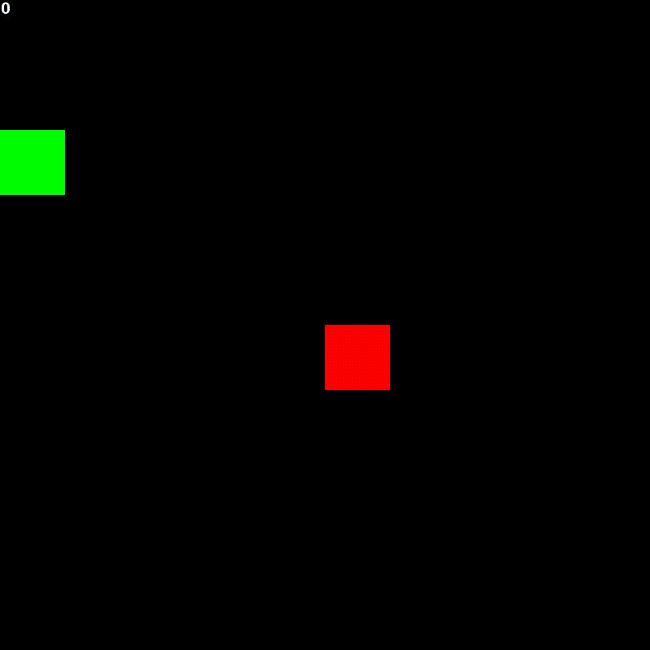

# 1. Snakevolution
Snakevolution is a project applying the concept of evolutionary computing to the game of Snake.

# 2. Evolutionary Algorithms
An evolutionary algorithm is a strategy to solve optimisation problems. Finding solutions for such
tasks is often difficult due to the large search space, i.e. the set of possible solutions is 
too large to find an exact solution. An evolutionary algorithm approximates the solution to an optimisation problem by evolving a set of
**candidate solutions** until a stop criterion is reached. 

First, a set of so called **candidate solutions** is randomly initialised. 
Thereafter, these solutions are assigned a fitness score depending on how well
they solve the problem. Usually, there is a positive correlation between the fitness score and the
performance of a solution, i.e. the higher the fitness score, the better the individual performed.
A better performing individual has more desirable traits, so the next step is to select a subset
of the population with desirable traits that we will recombine to create the next generation.
To do this step, we make use of crossover operators which will combine the genes of two
parents to create two offspring that inherit traits from both parents. Finally, the solutions
are mutated, i.e. some genes are randomly changed, and we create a new generation of solutions
with the recombined and mutated solutions.

The overall algorithm can be described as follows:

```
initialise population of size n

while stop criterion not met:
    evaluate fitness of candidate solutions
    make selection of candidate solutions
    crossover selection to create new candidate solutions
    mutate new candidate solutions
    create new population
```

# 3. Snake
Snake is a video game where the player controls a line representing the snake with the goal to grow the snake
as long as possible by eating food. Each food consumed grows the body of the snake by 1 block. 
Initially, the snake starts out with a length of 1. The game is won when the snake takes 
up every single block in the game, i.e. 100 blocks for a 10x10 grid. The game is 
over if the snake either hits any of the walls or itself. 



# 4. Snake Representation
Each snake is a Feed Forward Network (FFN) which receives an input representing the current 
state of the game and then outputs an action for the snake to take. The state of the game can be
thought of as what the snake sees at a given point in the game. 

## 4.1 State Representation
The state that the snake receives as input can be represented in many different ways. When choosing
a state representation, one must make a tradeoff between keeping the state lightweight so that
the neural network is not too complex and encoding enough information so that the snake is able
to make the right decisions for the right state. Abstracting away information means that
the set of possible states the snake can find itself in becomes smaller, however it also means
that some granularity is lost. Likewise, encoding unnecessary information blows up the set of
possible states that the snake will have to learn the correct output for.

## 4.2 Choosing Necessary Information
When selecting the information that should be included in the state representation it is helpful to think
how you as a human would play the game. Things you would want to know are the direction the snake
is currently moving in, where the obstacles are relative to the head of the snake, and where the 
food is relative to the snake's head.

There is of course more information that can be useful, e.g. the current length of the snake or
the position of all of the snake's segments. The reason they are not considered here is because
all of the previous mentioned information can be encoded in a simple boolean vector.

## 4.3 Boolean State Representation
The state representation chosen is a boolean vector which includes the following information
* whether there is any immediate danger around the snake's head
* the current absolute direction of the snake
* the location of the food relative to the snake's head

Using a boolean state representation means that the set of possible states the snake has to 
learn is smaller than a state that is represented with scalars for instance. In fact, the 
set of states will remain the same size, no matter the size of the game. It means that we can
train the snake on a smaller game and run it on any size game.

Since we need the inputs to our neural network to be numbers, the boolean values `true` and
`false` are represented by `1` and `0` respectively.


### 4.3.1 Immediate Danger
The immediate danger is a 1D vector of 3 booleans which tells the snake whether there is any 
danger to the left, right, or straight ahead of the snake's head. The first value indicates 
danger to the left, the second value is for danger straight ahead, and the third value is for 
danger right. Danger means that a move in that direction will cause the game to be over.
Here are some example vectors:

```
[1, 0, 0] -> danger to the left
[0, 1, 0] -> danger straight ahead
[0, 0, 1] -> danger to the right
[1, 1, 0] -> danger to the left and straight ahead
[1, 1, 1] -> danger to the left, straight ahead, and to the right
```


### 4.3.2 Absolute Direction
The absolute direction is a 1D vector of 4 booleans which tells the snake whether it is currently
moving left, right, up, or down in the game. Because the snake can only move in one direction
at a given point in time, the vector must only have one value set to `1`. This gives the following
possibilities:

```
[1, 0, 0, 0] -> direction is up
[0, 1, 0, 0] -> direction is down
[0, 0, 1, 0] -> direction is left
[0, 0, 0, 1] -> direction is right
```


### 4.3.3 Food Location
The location of the food is a 1D vector of 4 booleans which tells the snake the direction of the 
food relative to snake's head. As we want the snake to move towards the food, the absolute direction
defined in the previous section will help the snake pick the correct action for the next move.
Example values for the vector are:

``` 
[1, 0, 0, 0] -> the food is above the snake's head in the same column
[0, 1, 0, 0] -> the food is below the snake's head in the same column
[0, 0, 1, 0] -> the food is to the left of the snake's head in the same row
[0, 0, 0, 1] -> the food is to the right of the snake's head in the same row
[1, 0, 1, 0] -> the food is up to the left of the snake's head
[0, 1, 0, 1] -> the food is down to the right of the snake's head
```


# 5. Project Structure
* agents
* evolution
* util
* test

# 6. Setting up the Project

## 6.1 Install conda
snakevolution is a conda project, so conda needs to be installed to run the program. Follow the
instructions on the official [conda page](https://conda.io/projects/conda/en/latest/user-guide/install/index.html).

## 6.2 Setup the conda environment
After installing conda, the conda environment needs to be set up. The environment is described with the `environment.yml`
file. To create a conda environment from the file execute the following in the root directory of the project:
``` 
conda env create -f environment.yml
```

## 6.3 Activate the conda environment
The conda environment needs to be activated for the program to run.
```
conda activate snakevolution
```

# 7. Understanding selection pressure
In biology, selection pressures are external factors which affect an organism's ability to survive
in an environment. If the selection pressures are high, only the individuals with the most desirable
traits are able to reproduce. Contrary, if the selection pressures are low, weaker individuals are also
able to reproduce.

Within evolutionary computing, a high selection pressure means that we are more likely to select
individuals that have a high fitness score for reproduction. A low selection pressure means that
individuals with lower fitness scores are also able to reproduce. 

If the selection pressure is high and only the fittest individuals are allowed to reproduce, 
the diversity within the population will decrease, causing the explored search space to shrink faster, 
which in turn means that the algorithm to converge faster. A lower selection pressure then means that we keep
a more diverse population and can keep exploring a larger search space at the cost of slower convergence.

# 8. How to train the evolutionary algorithm
Evolutionary algorithms have many hyperparameters that affect the performance and convergence of the
algorithm. Many of the hyperparameters affect the selection pressure experienced by the population. These 
are the hyperparameters, their legal values, and their types available for tuning:

|hyper parameter   | type  | legal values  | explanation  |  
|---|---|---|---|
| generations  | int  | (-inf, inf)  |  the number of generations that the population will evolve for  |  
| population_size  | int  | (-inf, inf)  | the number of individuals in the population  |  
| mutation_rate  | int  | [0.0, 1.0]  |  the probability of a random mutation occurring for each gene  | 
| crossover_rate | float | [0.0, 1.0] | the probability that a crossover between two parents will occur |
| selection_type| string | {"TOURNAMENT", "RANK", "ROULETTE"} | the name of the selection function to be used |
| selection_params| {} | additional parameters that will be passed to the selection function | 
| type| string | {"GENERATIONAL", "STEADY_STATE"} | the type of algorithm to be run |
| replacement_function| string | {"REPLACEMENT"} | the type of replacement function to be used |
| elitism| float | [0.0, 1.0] | the percentage of best performing individuals that will be copied to the next generation unchanged |
| graphics| bool | {true, false} | whether to show the graphics of the snake game |
| neural_network| [int] | any positive integer | the hidden layers to be used in the neural network. [5] means a single hidden layer with 5 nodes |

These hyperparameters are passed to a program in a `.json` file. The `hyper_params.json` file
is an example file, though the file can live anywhere on the file system. Once the file is
created, the training can be started as follows:
```
python train.py -hp=hyper_params.json -ex=1
```
The `-hp` flag takes the path to the parameters file and the `ex` flag is how often the training
should be executed. If you want to gather some data on how a set of hyper parameters performs you
can specify to run it as many times as needed.

# 9. How to play with a trained model
To load a trained model you simply need to provide the path to the directory where the `torch` model 
lives on the file system. The loader will then look for a `torch_model` file within that directory
and load it, if it is found.
```
python play.py -m=path_to_directory
```


